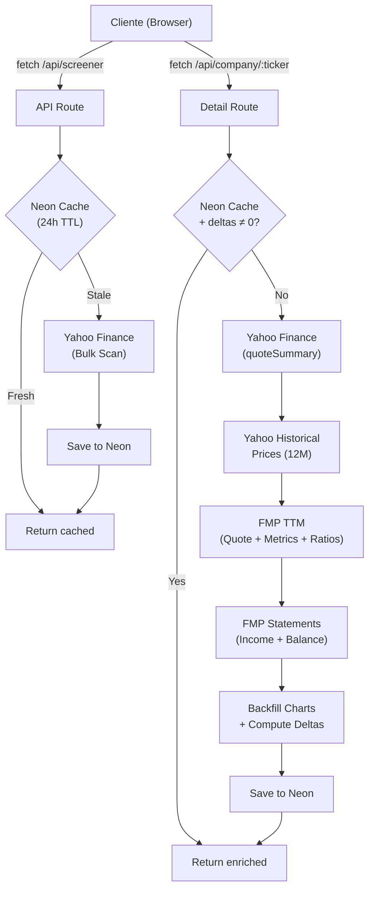

# Astro Trader Insights — Architecture Master

> Documento maestro de referencia técnica. Última actualización: 2026-04-07.

---

## 1. Visión general

**Astro Trader Insights** es una plataforma de análisis financiero algorítmico que combina métricas fundamentales clásicas (FCF Yield, Book-to-Market, márgenes, ROE/ROC) con indicadores macro-astrológicos (turbulencia planetaria, ciclos lunares, retrogradación de Mercurio) para generar señales de inversión accionables.

```
┌──────────────────────────────────────────────────────────┐
│                    ASTRO TRADER                           │
│                                                          │
│  ┌──────────┐  ┌──────────────┐  ┌───────────────────┐   │
│  │ Sidebar  │  │  Page Router  │  │     Header        │   │
│  │ (nav)    │  │  (page.tsx)   │  │                   │   │
│  └──────────┘  └──────┬───────┘  └───────────────────┘   │
│                       │                                   │
│       ┌───────────────┼───────────────┐                   │
│       │               │               │                   │
│  ┌────▼────┐   ┌──────▼──────┐  ┌────▼────┐              │
│  │  Macro  │   │  Explorer   │  │  Wiki   │              │
│  │  Hub    │   │  Dashboard  │  │  View   │              │
│  │ (8 sub) │   │ + Screener  │  │         │              │
│  └─────────┘   └─────────────┘  └─────────┘              │
│                                                          │
│  ┌──────────────────────────────────────────────────┐    │
│  │             Zustand Store (Global State)          │    │
│  └──────────────────────────────────────────────────┘    │
│                                                          │
│  ┌──────────────────────────────────────────────────┐    │
│  │     3-Layer Data Provider (Yahoo → Neon → FMP)    │    │
│  └──────────────────────────────────────────────────┘    │
└──────────────────────────────────────────────────────────┘
```

---

## 2. Stack tecnológico

| Capa | Tecnología | Versión |
|------|-----------|---------|
| Framework | Next.js (App Router) | 16.2.1 |
| UI | React | 19.2.4 |
| Estado | Zustand | 5.0.12 |
| CSS | Tailwind CSS 4 + CSS Custom Properties | 4.x |
| Charts | ECharts (via echarts-for-react) | 6.0.0 |
| Animaciones | Framer Motion | 12.38.0 |
| Iconos | Lucide React | 1.7.0 |
| Tipografía | Inter (sans) + JetBrains Mono (mono) | Google Fonts |
| Base de datos | Neon PostgreSQL (serverless) | — |
| ORM | Drizzle ORM | 0.45.2 |
| API Financiera #1 | Yahoo Finance 2 | 3.14.0 |
| API Financiera #2 | Financial Modeling Prep (FMP) | REST |
| API Crypto | CoinGecko | REST |

---

## 3. Estructura de directorios

```
src/
├── app/                          # Next.js App Router
│   ├── layout.tsx                # Root layout (fonts, metadata)
│   ├── page.tsx                  # Route controller por sección activa
│   ├── globals.css               # Design system (tokens + utilities)
│   └── api/                      # Server-side API routes
│       ├── company/[ticker]/     # Detalle de empresa individual
│       ├── screener/             # Screener masivo por mercado
│       ├── crypto-screener/      # Screener crypto por categoría
│       ├── macro/                # Timeline astro-macro (mensual cache)
│       └── macro-daily/          # Precios diarios S&P/BTC/Gold/Nasdaq
│
├── components/                   # Componentes React (20 archivos)
│   ├── Sidebar.tsx               # Navegación principal + sub-nav Macro
│   ├── Header.tsx                # Barra superior con counters
│   ├── Dashboard.tsx             # Explorer: Market Selector + card grid
│   ├── CompanyCard.tsx           # Card de empresa en el grid
│   ├── CompanyDetail.tsx         # Panel lateral de detalle (8 secciones)
│   ├── CryptoDetail.tsx          # Panel lateral crypto
│   ├── ScreenerView.tsx          # Screener con filtros avanzados
│   ├── ExplorerFilters.tsx       # Sliders de filtrado lateral
│   ├── FinancialCharts.tsx       # PriceChart, MarginChart, ReturnChart, ScoreBreakdownChart
│   ├── ScoreRing.tsx             # Anillo SVG de puntuación circular
│   ├── DataSourceToggle.tsx      # Toggle Live / Mock data
│   ├── MacroOverview.tsx         # Cosmic Fluidity + Signal Timing
│   ├── MacroDashboard.tsx        # Astro Turbulence timeline
│   ├── LunarCyclesView.tsx       # Análisis de ciclos lunares
│   ├── MercuryRetrogradeView.tsx # Retrogradación de Mercurio
│   ├── SolarActivityView.tsx     # Análisis de actividad solar (SSN)
│   ├── SectorRotationView.tsx    # Rotación de sectores por gobernador planetario
│   ├── FibonacciConfluenceView.tsx # Zonas de confluencia Fibonacci-Astro
│   ├── BacktestView.tsx          # Backtesting engine
│   └── WikiView.tsx              # Documentación interna
│
├── lib/                          # Lógica de negocio
│   ├── types.ts                  # Tipos core: Company, AlgorithmScore, etc.
│   ├── algorithm.ts              # Motor de scoring (4 pilares)
│   ├── macro-algorithm.ts        # Motor de turbulencia astrológica
│   ├── store.ts                  # Zustand state management
│   ├── market-groups.ts          # Definición de mercados y tickers
│   ├── mock-data.ts              # Datos de demo
│   ├── lunar-data.ts             # Fases lunares 1946–2030
│   ├── mercury-data.ts           # Períodos retrógrados 2000–2030
│   ├── solar-data.ts             # Datos de manchas solares (SILSO)
│   ├── overlay-indices.ts        # Definición de índices overlay (S&P, BTC, Gold, Nasdaq)
│   ├── geo-events.ts             # Eventos geopolíticos históricos
│   ├── utils.ts                  # Helpers (clamp, formatters)
│   └── api/                      # Clientes de APIs externas
│       ├── provider.ts           # Orquestador 3 capas (Yahoo→Neon→FMP)
│       ├── yahoo-client.ts       # Yahoo Finance wrapper
│       ├── fmp-client.ts         # FMP REST client
│       ├── fmp-mappers.ts        # FMP → domain type mappers
│       ├── coingecko-client.ts   # CoinGecko REST client
│       ├── crypto-provider.ts    # Proveedor crypto
│       ├── crypto-algorithm.ts   # Scoring crypto adaptado
│       └── types.ts              # Tipos FMP crudos
│
└── db/                           # Persistencia
    ├── index.ts                  # Conexión Drizzle + Neon
    └── schema.ts                 # Schema PostgreSQL (3 tablas)
```

---

## 4. Flujo de datos

### 4.1 Estrategia de 3 capas (provider.ts)



### 4.2 Flujo de enriquecimiento por empresa

| Paso | Fuente | Datos obtenidos | API Calls |
|------|--------|-----------------|-----------|
| 1 | Yahoo Finance `quoteSummary` | Precio, cap, márgenes, equity, income history | 1 |
| 2 | Yahoo Finance `historical` | Precios semanales 12M | 1 |
| 3 | FMP `quote` + `key-metrics-ttm` + `ratios-ttm` | Precio refinado, FCF Yield, ROE/ROIC, P/B, márgenes | 3 |
| 4 | FMP `income-statement` + `balance-sheet` | Deltas interanuales, EBITDA growth, asset growth | 2 |
| 5 | Backfill | Interpolación lineal de metrics sobre historicalData | 0 |
| **Total** | | | **7** |

---

## 5. Motor de scoring algorítmico

### 5.1 Pesos del algoritmo (acciones)

```
┌─────────────────────────────────────────────────┐
│           TOTAL SCORE (0–100)                   │
│                                                 │
│  ┌──────────┐ ┌─────────┐ ┌────────┐ ┌───────┐ │
│  │Valuation │ │ Trend   │ │Timing  │ │ Macro │ │
│  │  40%     │ │  30%    │ │  20%   │ │  10%  │ │
│  │          │ │         │ │        │ │       │ │
│  │ FCF Yield│ │ Margins │ │ 52W Lo │ │ Rates │ │
│  │ B/M      │ │ ROE/ROC │ │ Momntn │ │       │ │
│  └──────────┘ │ Growth  │ └────────┘ └───────┘ │
│               └─────────┘                       │
└─────────────────────────────────────────────────┘
```

### 5.2 Hard Filters (adaptados por tier)

| Filter | Small Cap | Mid Cap | Large Cap |
|--------|-----------|---------|-----------|
| Total Equity | > 0 | > 0 | > 0 (flexible) |
| Operating Profit | > 0 | > 0 | > 0 |
| Market Cap | < maxSlider | < maxSlider | < maxSlider |

### 5.3 Clasificación por Market Cap

| Tier | Rango |
|------|-------|
| Small | < $2B |
| Mid | $2B – $10B |
| Large | > $10B |

### 5.4 Recomendaciones

| Score | Recomendación |
|-------|---------------|
| ≥ 75 | STRONG_BUY |
| ≥ 55 | BUY |
| ≥ 35 | HOLD |
| < 35 | AVOID |

---

## 6. Módulo Macro (Astro Insights)

### 6.1 Motor de turbulencia (macro-algorithm.ts)

El motor genera un timeline de "turbulencia astrológica" usando **funciones gaussianas** sobre una base de datos de tránsitos planetarios:

- **TENSION_PEAKS**: Aspectos tensos (Saturn-Uranus Sq, Pluto-Uranus Sq...) → Turbulencia alta
- **FLUIDITY_PEAKS**: Aspectos armónicos (Jupiter-Uranus Trine, Saturn-Neptune Conj...) → Turbulencia baja

Cada tránsito tiene:
- `intensity`: Magnitud del pico (0–100)
- `spreadDays`: Dispersión temporal Gaussiana
- `date`: Centro del pico

**Fórmula**: `turbulence(t) = Σ gaussian(t - peakDate, intensity, spreadDays)` clamped [0, 100]

### 6.2 Sub-vistas

| Sub-vista | Componente | Descripción |
|-----------|-----------|-------------|
| Overview | `MacroOverview.tsx` | Cosmic Fluidity Score (gauge) + Signal Timing + Strategy Planner |
| Astro Turbulence | `MacroDashboard.tsx` | Timeline de turbulencia superpuesto con S&P 500/BTC |
| Lunar Cycles | `LunarCyclesView.tsx` | Análisis de retornos por fase lunar (Dichev & Janes) con datos diarios |
| Mercury Rx | `MercuryRetrogradeView.tsx` | Análisis de retrogradación con backtesting integrado |
| Solar Activity | `SolarActivityView.tsx` | Ciclo solar (SSN) con análisis de regímenes (max/min) y retornos |
| Sector Rotation | `SectorRotationView.tsx` | ETFs sectoriales con gobernador planetario y scoring de fases cíclicas |
| Fibonacci Confluence | `FibonacciConfluenceView.tsx` | Zonas de confluencia Fibonacci × eventos astrológicos (170+ eventos) |
| Backtester | `BacktestView.tsx` | Simulador de estrategias astro-filtradas vs Buy & Hold |

### 6.3 Cosmic Fluidity Score

Indicador compuesto (0–100) que agrega:
- **Astro Turbulence**: Peso 40% — Régimen actual (calm/moderate/elevated/high)
- **Lunar Phase**: Peso 35% — Distancia a luna nueva (cosine-weighted)
- **Mercury Status**: Peso 25% — Directo = 100, Retrógrado = 0 (con gradiente pre-shadow)

> **Importante**: El cálculo de turbulencia del Overview usa la misma llamada directa single-day que el módulo Astro Turbulence (`generateMacroTimeline(todayStr, todayStr, 1)`) para garantizar consistencia exacta entre ambas vistas.

### 6.4 Módulo Fibonacci-Astro Confluence

El módulo detecta zonas de confluencia donde el precio toca un nivel Fibonacci al mismo tiempo que ocurre un evento astrológico:

- **Swing Detection**: Detección adaptativa de pivotes (highs/lows) con window `min(60, data.length/6)`
- **Fibonacci Ranges**: Niveles 23.6%, 38.2%, 50%, 61.8%, 78.6% entre cada par de pivotes
- **Confluence Matching**: Precio dentro de ±2.5% de un nivel Fib && evento astrológico dentro de ±7 días
- **Categorías**: Heavy Transits, Mercury Rx, Eclipses — cada una toggleable con recálculo dinámico de reversal rate
- **Reversal Rate**: Porcentaje de confluencias que preceden un movimiento >3% en dirección opuesta en 30 días
- **Interactividad**: Click en confluencia → pin sus Fibonacci; tooltip rico en los orbes del gráfico
- **Assets soportados**: S&P 500, BTC, Gold (GLD), Nasdaq (QQQ)

> **Nota conceptual**: Reversal ≠ caída. El módulo mide *cambio de dirección*, no dirección. Astro Turbulence mide si el mercado *sufre* (caída en índice de turbulencia); Fibonacci Confluence mide si esa turbulencia *genera un pivote* en zonas de precio estructural.

### 6.5 Módulo Sector Rotation

Analiza ETFs sectoriales bajo la lente de gobernadores planetarios:

- **11 sectores**: XLK (Tecnología/Uranus), XLF (Finanzas/Jupiter), XLE (Energía/Pluto), etc.
- **Planetary Governor**: Cada sector asignado a un planeta con lógica de fase fuerte/neutra/débil
- **Phase Scoring**: Performance del ETF en cada fase cíclica (strong/neutral/weak)
- **Backtesting**: Datos reales de Yahoo Finance por ETF vía `/api/macro-daily`

---

## 7. Base de datos (Neon PostgreSQL)

### 7.1 Schema

```sql
-- Empresas (cache diario)
companies (
  ticker       TEXT PRIMARY KEY
  name         TEXT NOT NULL
  sector, exchange, description TEXT
  -- 20+ columnas de métricas financieras (real)
  historicalData  JSONB (array de puntos para charts)
  enrichedByFmp   BOOLEAN
  lastScannedAt   TIMESTAMP
  lastEnrichedAt  TIMESTAMP
)

-- Log de escaneos
scan_log (
  id             INTEGER PK (auto-increment)
  scanType       TEXT ('yahoo_bulk' | 'fmp_enrich')
  companiesCount INTEGER
  status         TEXT
  createdAt      TIMESTAMP
)

-- Crypto assets
crypto_assets (
  symbol         TEXT PRIMARY KEY
  name           TEXT NOT NULL
  coingeckoId    TEXT UNIQUE
  -- Métricas de mercado + momentum
  scoreData      JSONB
  lastScannedAt  TIMESTAMP
)
```

### 7.2 Cache inteligente

- **TTL**: 24 horas para datos enriquecidos
- **Cache-busting**: Fuerza re-enriquecimiento si `deltas === 0` (detección de datos incompletos)
- **Estrategia**: Write-through — los datos se guardan inmediatamente tras el enriquecimiento

---

## 8. API Routes

| Endpoint | Método | Descripción | Cache |
|----------|--------|-------------|-------|
| `/api/screener` | GET | Screener masivo por mercado (tickers predefinidos) | Neon 24h |
| `/api/company/[ticker]` | GET | Detalle completo de empresa individual | Neon 24h (con delta-check) |
| `/api/crypto-screener` | GET | Screener crypto por categoría CoinGecko | Neon 24h |
| `/api/macro` | GET | Timeline astro-macro completo | Next.js revalidate |
| `/api/macro-daily` | GET | Precios diarios S&P/BTC/Gold/Nasdaq | Next.js 24h |

---

## 9. Estado global (Zustand)

### 9.1 State shape

```typescript
{
  companies: Company[]
  scores: AlgorithmScore[]
  macro: MacroContext
  dataSource: "live" | "mock"
  activeSection: "macro" | "explorer" | "screener" | "watchlist" | "wiki" | "settings"
  assetClass: "stocks" | "crypto"
  macroSubSection: "overview" | "turbulence" | "lunar" | "mercury" | "solar" | "sector" | "fibonacci" | "backtest"
  selectedMarket: MarketGroupId | null
  filters: ExplorerFilters
  selectedCompanyId: string | null
  isDetailOpen: boolean
  isLoading: boolean
  apiCallCount: number
  error: string | null
}
```

### 9.2 Actions principales

| Action | Descripción |
|--------|-------------|
| `initializeData()` | Carga mock data al inicio |
| `setActiveSection()` | Cambia la sección de navegación |
| `setDataSource()` | Toggle entre Live y Mock mode |
| `fetchLiveData(market)` | Carga empresas de un mercado específico |
| `fetchCompanyDetail(ticker)` | Enriquece una empresa con FMP |
| `addCompanyByTicker(ticker)` | Busca y añade una empresa por ticker |
| `selectCompany(id)` | Abre/cierra panel detalle |
| `recalculateScores()` | Recalcula scores con filtros/macro actuales |

---

## 10. Navegación

```
┌─ Sidebar (72px) ──────────────────────────────┐
│                                                │
│  🔮 ASTRO (logo)                               │
│                                                │
│  📊 Macro ◄── Sección por defecto              │
│     ├── 🎯 Overview                            │
│     ├── ⚡ Astro Turbulence                     │
│     ├── 🌑 Lunar Cycles                        │
│     ├── ☿ Mercury Rx                           │
│     ├── ☀ Solar Activity                       │
│     ├── 🏛 Sector Rotation                     │
│     ├── 🎯 Fibonacci Confluence                │
│     └── 🧪 Backtester                          │
│                                                │
│  🔍 Explorer                                   │
│  📈 Screener                                   │
│  📌 Watchlist (coming soon)                    │
│  📖 Wiki                                       │
│  ⚙️ Settings (coming soon)                     │
│                                                │
│  ── Divider ──                                 │
│  💹 Stocks ←→ 🪙 Crypto (asset class toggle)   │
└────────────────────────────────────────────────┘
```

---

## 11. Componentes clave

### 11.1 CompanyDetail (8 secciones)

| # | Sección | Datos | Visualización |
|---|---------|-------|---------------|
| 1 | Score Breakdown | Valuation/Trend/Timing/Macro | Radar chart + métricas |
| 2 | Hard Filters | Equity, MCap, OpProfit | Pass/Fail badges |
| 3 | Valuation (40%) | FCF Yield, Book-to-Market | Metric rows |
| 4 | Trend & Quality (30%) | Margin evolution, ROE/ROC, Growth | ECharts line charts |
| 5 | Timing & Momentum (20%) | Price 12M, 52W range, returns | ECharts + metric rows |
| 6 | Description | Company longBusinessSummary | Text block |

### 11.2 MacroOverview (layout 2/3 + 1/3)

- **Izquierda (2/3)**: Cosmic Fluidity Score (gauge animado ECharts)
- **Derecha (1/3)**: Signal Timing Panel
  - Current Position (HOLD/CAUTIOUS, BUY, AVOID)
  - Next Entry Signal (fecha + fuente + confianza)
  - Next Exit Signal (fecha + fuente + confianza)
  - Strategy Planner expandible (Signal Alignment Calendar 90 días)

---

## 12. Variables de entorno

| Variable | Uso |
|----------|-----|
| `DATABASE_URL` | Conexión Neon PostgreSQL |
| `FMP_API_KEY` | Clave de API Financial Modeling Prep |

> Yahoo Finance y CoinGecko no requieren API key (acceso público con rate limiting).
